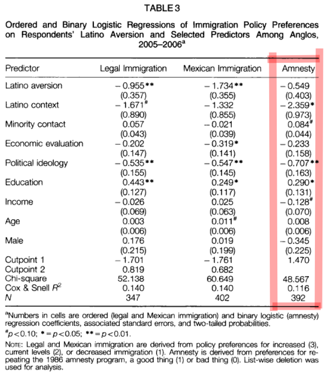

## Introduction and Replication - Question 1

Harvard Dataverse Link - https://doi.org/10.7910/DVN/OSSD8O  
JSTOR Stable Link to Paper - https://www.jstor.org/stable/42940606  
Link to github repository - https://github.com/jrisi256/schoolwork/tree/main/plsc597/hw1/src

### Introduction - Is Immigration a Racial Issue? Anglo Attitudes on Immigration Policies in a Border County.

* The purpose of the study is to assess the association between Anglo aversion to Latinos and a variety of other factors including: physical proximity to Latinos, contact with ethnic minorities, and expressed preferences for immigration policies.
* The underlying hypothesis argues immigration policy preferences are strongly influenced by racial resentment rather than other considerations like economic anxiety.
* Other hypotheses argue Anglos living in neighborhoods with larger proportions of Latinos will harbor more restrictive attitudes on immigration, but Anglos who interact more frequently with minorities will harbor less restrictive attitudes on immigration.

### Data and Methods

* Data was collected through a telephone survey using random-digit-dial procedures in San Diego County, California in 2005 - 2006. Data were weighted in all regressions to represent San Diego County demographic characteristics for Anglos based on US Census estimates. No significant differences appeared in conclusions when analyses were replicated using unweighted values.
* **Dependent Variable**: The dependent variable of interest was survey respondents' answers to the amnesty question: "As you may know, in 1986 the US Congress passed the Immigration Reform and Control Act, which granted amnesty to nearly 2 million persons who had lived continuously in this country for four or more years without proper documentation. This amnesty law allowed these immigrants to remain here as permanent residents and to apply for US citizenship. At this time, do you think repeating this amnesty program would be a good thing?" 0 = bad idea, 1 = good idea.
* **Independent Variables**
    * Respondent aversion to Latinos (attitude about Latinos): Measured using the Bogardus scale which is a composite index to detect racial attitudes. Recoded as a dummy variable where 1 means aversion was detected and 0 means no aversion was detected.
    * Latino context (concentration in the same Census tract): The natural log of the percent of Latino residents within each respondent's Census tract.
    * Reported contact with minorities: Composite scale summarizing interactions respondents had with Latinos.
* **Controls**
    * Personal financial situation; "In terms of your personal economic situation, would you say that it has improved, remained the same, or gotten worse over the past 12 months?"
    * Family Income.
    * Age.
    * Education.
    * Gender.
    * Political Ideology: "Would you consider yourself conservative, moderate, or liberal?" Liberals were coded as low and conservatives as high.
* **Codebook**
    * Amnesty = amnesty
    * Latino Aversion = dishis2
    * Latino context = pcthis2
    * Latino contact = contact
    * Personal financial situation = retecon
    * Political ideology = idea
    * Education = edu2
    * Famliy Income = income
    * Age = age
    * Sex = male
* **Results**
    * Age, gender, and personal financial situation are not statistically significant. In contrast to the their hypothesis, Latino aversion was not statistically significant either.
    * Increased minority contact was positively associated with amnesty however it was only marginally significant.
    * Decreased income was negatively associated with amnesty however it was only marginally significant.
    * Latino context was negatively and statistically significantly associated with amnesty meaning the more Latinos living in your Census tract the more likely you were to view amnesty as a bad thing.
    * Increased education was positively and statistically significantly associated with amnesty.
    * As one became more conservative, the probability of supporting amnesty decreased. Highly statistically significant.

### Packages

```{r, warning = F, message = F}
library(mlr)
library(here)
library(dplyr)
library(foreign)
```

### Read in the data

```{r}
ssq <- foreign::read.dta(here("hw1/data/ssq.dta"))
```

### Light data cleaning

Select only relevant columns for the regression and remove all rows with a missing value on any of the variables. Turn all variables into numeric values (to match the results from the paper).

```{r}
X2 <-
    ssq %>%
    select(amnesty, dishis2, pcthis2, contact, retecon, idea, edu2, income2,
           age, male, wteth) %>%
    filter(across(everything(), ~!is.na(.x))) %>%
    mutate(across(everything(), as.numeric)) %>%
    mutate(amnesty = as.factor(amnesty))
```

### Estimate regression

```{r}
# Make the learning task
amnestyTaskPaper <- makeClassifTask(data = select(X2, -wteth),
                                    target = "amnesty",
                                    weights = X2$wteth)

# Create a logistic regression learner
logRegLearner <- makeLearner("classif.logreg", predict.type = "prob")

# Train or fit the model on the whole dataset
amnestyModelPaper <- train(logRegLearner, amnestyTaskPaper)
summary(amnestyModelPaper$learner.model)
```



## Question 2

### Create test and train

```{r}
set.seed(420)

# Add in new variables
X2new <- X2 %>% mutate(ideaF = as.factor(idea))

# Make test and train sets
train <- X2new %>% sample_frac(0.70)
test <- anti_join(X2new, train)

paperVars <- c("amnesty", "dishis2", "pcthis2", "contact", "retecon", "idea",
               "edu2", "income2", "age", "male", "wteth")
newVars <- c("amnesty", "pcthis2", "ideaF", "edu2", "wteth")

trainPaper <- train %>% select(all_of(paperVars))
testPaper <- test %>% select(all_of(paperVars))
trainNew <- train %>% select(all_of(newVars))
testNew <- test %>% select(all_of(newVars))
```

### Establish cross-validation performance of the model from the paper and the new model

```{r, warning = F, message = F}
# stratified sampling, 10 folds, repeat 200 times
cv <- makeResampleDesc(method = "RepCV", folds = 10, reps = 200, stratify = T)

# Create a task for training a model as specified by the paper
amnestyTaskPaper <- makeClassifTask(data = select(trainPaper, -wteth),
                                    target = "amnesty",
                                    weights = trainPaper$wteth)

# Apply the specified cross validation procedure to the model from the paper
paperTrainCv <- resample("classif.logreg", amnestyTaskPaper, resampling = cv)

# Create a task for training the newly specified model
amnestyTaskNew <- makeClassifTask(data = select(trainNew, -wteth),
                                  target = "amnesty",
                                  weights = trainNew$wteth)

# Apply the specified cross validation procedure to the newly specified model
newTrainCv <- resample("classif.logreg", amnestyTaskNew, resampling = cv)
```

Performance of model from paper (measured through cross validation): `r paperTrainCv$aggr`  
Performance of newly specified model (measured through cross validation): `r newTrainCv$aggr`

The combination of treating political ideology as a categorical variable and only including those variables which were found to be statistically significant in the paper (education, political ideology, and Latino context) boosts predictive performance by almost 1% as measured by accuracy.

I suspect I am moving away from the true data generating model. Mostly I am surprised aversion to Latinos wasn't significant and dropping it increases predictive performance (if only slightly). I suspect because the sample size is relatively small and because there aren't many people who reported aversion that these are the reasons the variable didn't reach significance and didn't add much in terms of predictive validity.

## Question 3

```{r}
# Train the paper model and my model
paperModelTrain <- train(logRegLearner, amnestyTaskPaper)
newModelTrain <- train(logRegLearner, amnestyTaskNew)

# Make predictions on the test set
predictPaperTest <- as_tibble(predict(paperModelTrain, newdata = testPaper))
predictNewTest <- as_tibble(predict(newModelTrain, newdata = testNew))

#Now, let's compute accuracy rate by comparing the truth and response columns
accuracyPaper <-
    predictPaperTest %>%
    mutate(correct = case_when(truth == response ~ 1,
                               truth != response ~ 0))

accuracyNew <-
    predictNewTest %>%
    mutate(correct = case_when(truth == response ~ 1,
                               truth != response ~ 0))

#divide correct cases by total cases
accPaper <- sum(accuracyPaper$correct) / nrow(accuracyPaper)
accNew <- sum(accuracyNew$correct) / nrow(accuracyNew)
```

Accuracy of model specified in the paper on the test data: `r accPaper`  
Accuracy of the newly specified model: `r accNew`

The newly specified model performs better on the out-of-sample prediction task. This could mean my model is closer to the true data generating process. I am doubtful this is case though for reasons explicated above mostly having to do again with small sample size issues.

```{r}
# Make the learning task
amnestyTaskNew <-
    makeClassifTask(data = select(X2new, amnesty, pcthis2, ideaF, edu2),
                                  target = "amnesty",
                                  weights = X2new$wteth)

# Train or fit the newly specified model on the whole dataset
amnestyModelNew <- train(logRegLearner, amnestyTaskNew)
summary(amnestyModelNew$learner.model)
```

Education loses its significance which is mildly interesting. More interesting is the political ideology variable broken out into categories. Even for somebody who professes to be moderate, there is a large decrease in the likelihood to view amnesty as a good idea. It then nearly doubles for those who profess to be conservative. This, to me, suggests further research into the nuances between political ideology and racial views. Even leaving race aside, the framing of the question may be leading. Liberals may be more likely to view those given amnesty as needy and deserving of it while conservatives viewed it as a unworthy handout in a way independent of their views on race.
