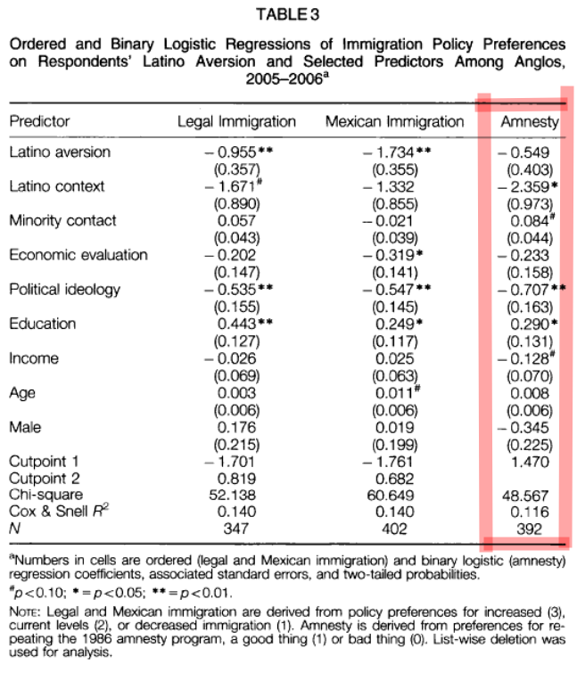

## Introduction and Replication - Question 1

Harvard Dataverse Link - https://doi.org/10.7910/DVN/OSSD8O  
JSTOR Stable Link to Paper - https://www.jstor.org/stable/42940606  
Link to github repository - https://github.com/jrisi256/schoolwork/tree/main/plsc597/hw2/src

### Introduction - Is Immigration a Racial Issue? Anglo Attitudes on Immigration Policies in a Border County.

* The purpose of the study is to assess the association between Anglo aversion to Latinos and a variety of other factors including: physical proximity to Latinos, contact with ethnic minorities, and expressed preferences for immigration policies.
* The underlying hypothesis argues immigration policy preferences are strongly influenced by racial resentment rather than other considerations like economic anxiety.
* Other hypotheses argue Anglos living in neighborhoods with larger proportions of Latinos will harbor more restrictive attitudes on immigration, but Anglos who interact more frequently with minorities will harbor less restrictive attitudes on immigration.

### Data and Methods

* Data was collected through a telephone survey using random-digit-dial procedures in San Diego County, California in 2005 - 2006. Data were weighted in all regressions to represent San Diego County demographic characteristics for Anglos based on US Census estimates. No significant differences appeared in conclusions when analyses were replicated using unweighted values.
* **Dependent Variable**: The dependent variable of interest was survey respondents' answers to the amnesty question: "As you may know, in 1986 the US Congress passed the Immigration Reform and Control Act, which granted amnesty to nearly 2 million persons who had lived continuously in this country for four or more years without proper documentation. This amnesty law allowed these immigrants to remain here as permanent residents and to apply for US citizenship. At this time, do you think repeating this amnesty program would be a good thing?" 0 = bad idea, 1 = good idea.
* **Independent Variables**
    * Respondent aversion to Latinos (attitude about Latinos): Measured using the Bogardus scale which is a composite index to detect racial attitudes. Recoded as a dummy variable where 1 means aversion was detected and 0 means no aversion was detected.
    * Latino context (concentration in the same Census tract): The natural log of the percent of Latino residents within each respondent's Census tract.
    * Reported contact with minorities: Composite scale summarizing interactions respondents had with Latinos.
* **Controls**
    * Personal financial situation; "In terms of your personal economic situation, would you say that it has improved, remained the same, or gotten worse over the past 12 months?"
    * Family Income.
    * Age.
    * Education.
    * Gender.
    * Political Ideology: "Would you consider yourself conservative, moderate, or liberal?" Liberals were coded as low and conservatives as high.
* **Codebook**
    * Amnesty = amnesty
    * Latino Aversion = dishis2
    * Latino context = pcthis2
    * Latino contact = contact
    * Personal financial situation = retecon
    * Political ideology = idea
    * Education = edu2
    * Famliy Income = income
    * Age = age
    * Sex = male
* **Results**
    * Age, gender, and personal financial situation are not statistically significant. In contrast to the their hypothesis, Latino aversion was not statistically significant either.
    * Increased minority contact was positively associated with amnesty however it was only marginally significant.
    * Decreased income was negatively associated with amnesty however it was only marginally significant.
    * Latino context was negatively and statistically significantly associated with amnesty meaning the more Latinos living in your Census tract the more likely you were to view amnesty as a bad thing.
    * Increased education was positively and statistically significantly associated with amnesty.
    * As one became more conservative, the probability of supporting amnesty decreased. Highly statistically significant.

### Packages

```{r, warning = F, message = F}
library(mlr)
library(here)
library(dplyr)
library(caret)
library(foreign)
library(parallel)
library(neuralnet)
library(parallelMap)
```

### Read in the data

```{r}
ssq <- foreign::read.dta(here("hw1/data/ssq.dta"))
```

### Light data cleaning

Select only relevant columns for the regression and remove all rows with a missing value on any of the variables. Turn all variables into numeric values (to match the results from the paper).

```{r}
X2 <-
    ssq %>%
    select(amnesty, dishis2, pcthis2, contact, retecon, idea, edu2, income2,
           age, male, wteth) %>%
    filter(across(everything(), ~!is.na(.x))) %>%
    mutate(across(everything(), as.numeric)) %>%
    mutate(amnesty = as.factor(amnesty))
```

### Estimate regression

```{r}
# Make the learning task
amnestyTaskPaper <- makeClassifTask(data = select(X2, -wteth),
                                    target = "amnesty",
                                    weights = X2$wteth)

# Create a logistic regression learner
logRegLearner <- makeLearner("classif.logreg", predict.type = "prob")

# Train or fit the model on the whole dataset
amnestyModelPaper <- train(logRegLearner, amnestyTaskPaper)
summary(amnestyModelPaper$learner.model)
```



## Question 2

### Create test and train

We scale our variables for use with the neural network and SVM (although SVM does it automatically I believe, it's OK we do it manually). Results don't need to be scaled for the random forest, but it shouldn't change the substantive findings.

```{r}
set.seed(420)
split <- createDataPartition(X2$amnesty, p = 0.8, list = F, times = 1)

train = X2[split,]
test = X2[-split,]

scaleTrain <- train %>% mutate(across(c(-wteth, -amnesty), ~as.numeric(scale(.x))))
scaleTest <- test %>% mutate(across(c(-wteth, -amnesty), ~as.numeric(scale(.x))))
```

### Set-up our training task, learners, and cross-validation strategy

It should be noted these algorithms do not use survey weights in contrast to logistic regression.

```{r}
# Make the training task
amnestyTaskTrain <- makeClassifTask(data = select(scaleTrain, -wteth),
                                    target = "amnesty")

# Create our learners
svm <- makeLearner("classif.svm")
randforest <- makeLearner("classif.randomForest", importance = T)
neuralnet <- makeLearner("classif.neuralnet")

# We will be using 10-fold cross-validation for hyperparameter tuning
kFold10 <- makeResampleDesc("CV", iters = 10)

# Explore 100 different combos of hyperparameters for SVM
randSearchSvm <- makeTuneControlRandom(maxit = 100)

# Explore 1000 different combos of hyperparameters for random forest
randSearchRf <- makeTuneControlRandom(maxit = 1000)

# Explore 500 different combos of hyperparameters for neural net
randSearchNn <- makeTuneControlRandom(maxit = 50)
```

### Tune the hyperparamters for the support vector machine

```{r, warning = F, message = F}
svmParamSpace <- makeParamSet(
    makeDiscreteParam("kernel", values = c("polynomial", "radial", "sigmoid")),
    makeIntegerParam("degree", lower = 1, upper = 3),
    makeNumericParam("cost", lower = 0.1, upper = 10),
    makeNumericParam("gamma", lower = 0.1, upper = 10))

ptm <- proc.time()

parallelStartSocket(cpus = detectCores())

tunedSvm <- tuneParams(svm,
                       task = amnestyTaskTrain,
                       resampling = kFold10,
                       par.set = svmParamSpace,
                       control = randSearchSvm,
                       measures = list(acc, fpr, fnr))

parallelStop()

proc.time() - ptm
```

### Tune the hyperparameters for random forest

```{r, warning = F, message = F}
forestParamSpace <-
    makeParamSet(makeIntegerParam("ntree", lower = 200, upper = 200),
                 makeIntegerParam("mtry", lower = 5, upper = 10),
                 makeIntegerParam("nodesize", lower = 1, upper = 10),
                 makeIntegerParam("maxnodes", lower = 5, upper = 30))

ptm <- proc.time()

parallelStartSocket(cpus = detectCores())

tunedRandForest <- tuneParams(randforest,
                              task = amnestyTaskTrain,
                              resampling = kFold10,
                              par.set = forestParamSpace,
                              control = randSearchRf,
                              measures = list(acc, fpr, fnr))

parallelStop()

proc.time() - ptm
```

### Tune the hyperparameters for the neural network

```{r, warning = F, message = F}
neuralNetParamSpace <-
    makeParamSet(makeNumericParam("threshold", lower = 0.7, upper = 0.7),
                 makeDiscreteParam("algorithm", values = c("rprop+")),
                 makeDiscreteParam("act.fct", values = c("logistic")),
                 makeIntegerVectorParam("hidden", len = 4, lower = 1, upper = 5))

ptm <- proc.time()

tunedNeuralNet <- tuneParams(neuralnet,
                             task = amnestyTaskTrain,
                             resampling = kFold10,
                             par.set = neuralNetParamSpace,
                             control = randSearchNn,
                             measures = list(acc, fpr, fnr))

proc.time() - ptm
```

### Compare the cross-validation performances of the 3 algorithms

Looking at accuracy, the false positive rate, and the false negative rate 

```{r}
tunedSvm
tunedRandForest
tunedNeuralNet
```

