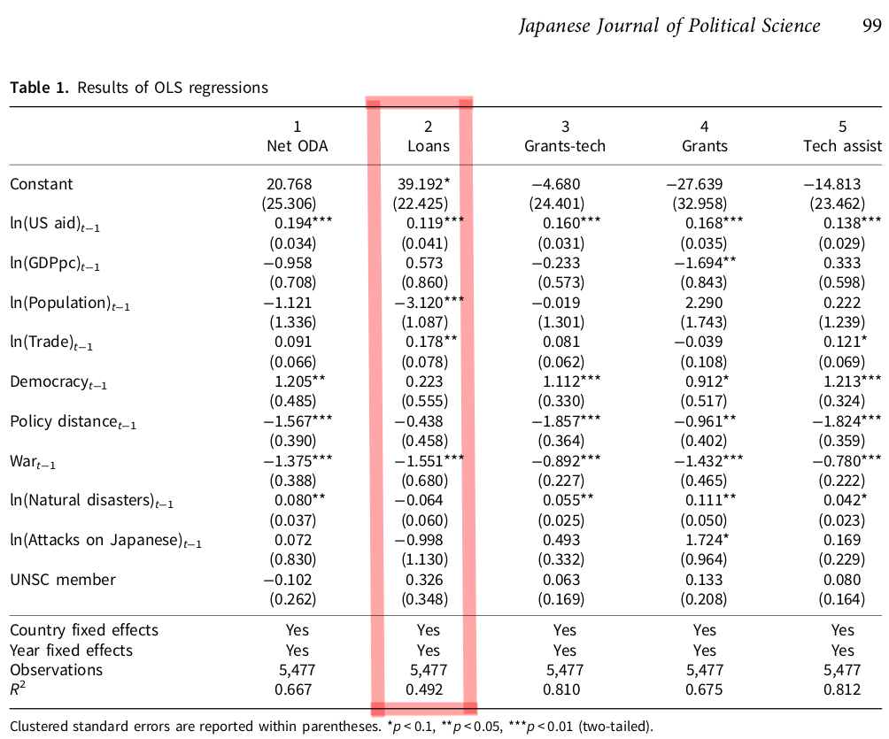

## Introduction and Replication - Question 1

* Harvard Dataverse Link - https://dataverse.harvard.edu/dataset.xhtml?persistentId=doi:10.7910/DVN/IOUQ5X
* Cambridge Core Stable Link - https://www-cambridge-org.ezaccess.libraries.psu.edu/core/journals/japanese-journal-of-political-science/article/explaining-variations-in-responsiveness-to-external-pressure-japans-aid-policy-and-bureaucratic-politics/EF0A1EAF5E54EB18A332C444CBE3A592
* Github Link to Code For Assignment - https://github.com/jrisi256/schoolwork/tree/main/plsc597/hw3/src

### Introduction: Explaining variations in responsiveness to external pressure: Japan’s aid policy and bureaucratic politics

* This paper attempts to provide an explanation as to how and in what direction the USA influence's Japan's aid policies and if the impact of USA influence varies across different types of aid.
* Results suggest the USA tends to urge Japan to complement USA aid efforts rather than to be a substitute for USA aid efforts as substitution would increase Japan's clout, reputation and influence potentially at the cost of the USA.
* Grants appear to be more receptive to USA pressure vs. loans potentially because loans are distributed in consultation with multiple parties each of whom only feels minimal USA pressure if any at all.

### Data and Methods

* Data for the dependent variables comes from the Ministry of Foreign Affair's website. Each observation is a record of aid flow from Japan to another country in a given year from the years 1971 - 2009.
* Data for the independent variables come from a variety of sources including but not limited to the United Nations Statistics Division, the USA Agency for International Development, and the Global Terrorism Database.
* **Dependent Variable**: **lyenloans2**: The dependent variable of interest is the net disbursement of loans by the Japanese government in a given year (in 2015 US dollars). The natural logarithm is applied to this variable and then 1 is added because the data is highly right skewed.
* **Independent Variables**:
    * **lusaid2l**: Sum of USA economic and military assistance to the given country in the given year. The natural logarithm is applied to this variable and then 1 is added. In the OLS regression, the variable is lagged by one year.
* **Control Variables**:
    * **lgdppcl**: Natural logarithm of per capita GDP.
    * **lpopl**: Natural logarithm of population.
    * **ltradel**: Natural logarithm (plus 1) of the sum of exports and imports between Japan and a country.
    * **democracy2**: Democracy indicator variable (1 if country is a democracy, 0 otherwise).
    * **jipdistance**: Policy distance between the two countries' voting patterns (measured as the distance between ideal point estimates of Japan and the recipient country in a given year).
    * **warl**: Is the recipient country at war? (1 if yes, 0 if otherwise).
    * **ltotaldeath2l**: Natural logarithm (plus 1) of the total amount of deaths due to natural disasters.
    * **ltargetjapanl**: Natural logarithm (plus 1) of the number of terrorist attacks targeting Japanese citizens in a given country in a given year.
    * **cmember**: Is the given country in a given year a member of the United Nations Security Council? 1 if they are temporary members, 0 otherwise. Permanent members are treated as missing.
    * Country and year are included as fixed-effect dummy variables.
* **Results**
    * **US aid** and **amount of trade** are positively and highly statistically significantly associated with Japanese net disbursement of loans. USA aid being positively associated with Japanese loan disbursement confirms the hypothesis of the paper which is that the USA pressures/influences Japan to align its aid with the USA. The trade variable finding seems logical as Japan has a small domestic market and lack of natural resources which would necessitate Japan exercising all options at their disposal to expand their import/export markets. Previous research has demonstrated mixed evidence regarding the effect of this variable though on Japanese aid.
    * **Population** and **war** are negatively and highly statistically significantly associated with Japanese net disbursement of loans. Previous research has demonstrated population has a negative relationship to Japanese aid due to the fact that smaller countries are easier to *buy off* as it were during UN voting. With each country receiving one vote, it's more efficient for Japan to aid many smaller countries than a few relatively bigger ones. The war variable finding make sense given Japan's emphasis on peace and pacifism post-WWII, the decreased likelihood of a warring state to repay its debts, and the increased difficulty and costs of assuring the safety of the personnel designated as dispersing the loan.
    * All other variables are not statistically significant.

### Packages

```{r, message = F, warning = F}
library(mlr)
library(here)
library(purrr)
library(dplyr)
library(caret)
library(readr)
library(tidyr)
library(stringr)
```

### Light data cleaning and Replication of Results

I turn year and country code into categorical variables to match results obtained in the paper, and I filter out all observations missing data. The coefficient results replicate. The standard errors are different due to the paper clustering standard errors by country. When I don't cluster by standard error, the substantive findings remain largely the same (one variable gains significance at the 0.05 level which we ignore because we aren't clustering).

```{r}
# Read in data
load(here("hw3/data/aid_data.RData"))

# Turn year and country code into categorical variables
dataClean <-
    table %>%
    select(lyenloans2, lusaid2l, lgdppcl, lpopl, ltradel, democracy2, jipdistance,
           warl, ltotaldeath2l, ltargetjapanl, cmember, year, ccode) %>%
    filter(across(everything(), ~!is.na(.x))) %>%
    mutate(year = as.factor(year),
           ccode = as.factor(ccode),
           democracy2 = as.integer(democracy2),
           warl = as.integer(warl),
           cmember = as.integer(cmember))
    
# Replicate results from paper
olsPaper <- lm(lyenloans2 ~ ., data = dataClean)
summary(olsPaper)
```



## Question 2

### Create test and train

democracy2, warl, ltotaldeath2l, ltargetjapanl, cmember, ccode, and year are all dropped due to sparseness/categorical variable issues with GAM.

```{r, warning = F, message = F}
# Set random seed
set.seed(420)

# Create test and train data
split <- createDataPartition(dataClean$lyenloans2, p = 0.7, list = F, times = 1)

# Drop problematic variables
dataCleanShort <-
    dataClean %>%
    select(-democracy2, -warl, -ltotaldeath2l, -ltargetjapanl, -cmember,
           -ccode, -year)

train <- dataCleanShort[split,]
test <- dataCleanShort[-split,]

# Create our list of features to hold out one-by-one (as well as full features)
features <- as.list(c(colnames(select(dataCleanShort, -lyenloans2)), "total"))
names(features) <- features

# Create new task for each new feature set
tasksTrain <- map(features, function(missingFeat) {
    if(missingFeat != "total")
        makeRegrTask(data = select(train, -matches(missingFeat)),
                     target = "lyenloans2")
    else
        makeRegrTask(data = train, target = "lyenloans2")
})
```

### Create learners and set cross-validation strategy

We will be using 3-fold cross-validation, and we will be exploring 60 different combinations of hyperparameters for the random forest algorithm.

```{r}
# Create our learners
ols <- makeLearner("regr.lm")
gam <- makeLearner("regr.gamboost")
rf <- makeLearner("regr.randomForest")

# 3-fold Cross-Validation
kFold3 <- makeResampleDesc("CV", iters = 3)

# Explore 100 different random hyperparameter combinations for random forest
randSearchRf <- makeTuneControlRandom(maxit = 60)
```

### Tune the parameters for random forest and cross-validate GAM

It should be noted root mean squared error is used to determine the best hyperparameters for the random forest algorithm, and it is used to determine the performance of the models trained using GAM.

```{r, message = F, warning = F}
# Tune the hyperparameters for random forest
rfParamSpace <-
    makeParamSet(makeIntegerParam("ntree", lower = 100, upper = 100),
                 makeIntegerParam("mtry", lower = 1, upper = 4),
                 makeIntegerParam("nodesize", lower = 1, upper = 10),
                 makeIntegerParam("maxnodes", lower = 5, upper = 30))

tunedRfs <- map(tasksTrain, function(task) {
    tuneParams(rf,
               task = task,
               resampling = kFold3,
               par.set = rfParamSpace,
               control = randSearchRf,
               measures = list(rmse))
})

# There are no hyperparameters we need to tune for GAMs
gamCVs <- map(tasksTrain, function(task) {
    resample(gam, task, resampling = kFold3, measures = list(rmse))
})

tunedRfs[["total"]]
gamCVs[["total"]]
```

If you try to fit a spline with only two values, there is perfect correlation within the spline components between x, x^2, x^3. You cannot fit a spline this way.

Only do the complex splines on the numerical variables.

Sees a factor variable, can't fit polynomials to this, fit a linear variable to this.

```{r}
dataCleanExample <- dataClean %>% select(democracy2, lyenloans2)
summary(dataCleanExample$democracy2)
table(dataCleanExample$democracy2)
class(dataCleanExample$democracy2)

trainE <- dataCleanExample[split,]

exampleTask <- makeRegrTask(data = trainE, target = "lyenloans2")
resample(gam, exampleTask, resampling = kFold3, measures = list(rmse))
```

```{r}
dataCleanExample2 <- dataClean %>% select(lusaid2l, lyenloans2)
summary(dataCleanExample2$lusaid2l)

trainE2 <- dataCleanExample2[split,]

exampleTask2 <- makeRegrTask(data = trainE2, target = "lyenloans2")
resample(gam, exampleTask2, resampling = kFold3, measures = list(rmse))
```

```{r}
trainENum <- trainE %>% mutate(democracy2 = as.numeric(democracy2))
class(trainENum$democracy2)

exampleTaskNum <- makeRegrTask(data = trainENum, target = "lyenloans2")
resample(gam, exampleTaskNum, resampling = kFold3, measures = list(rmse))
```

```{r}
trainEFac <- trainE %>% mutate(democracy2 = as.factor(democracy2))
class(trainEFac$democracy2)

exampleTaskFac <- makeRegrTask(data = trainEFac, target = "lyenloans2")
resample(gam, exampleTaskFac, resampling = kFold3, measures = list(rmse))
```

```{r}
dataCleanExample3 <-
    dataClean %>%
    select(lusaid2l, ccode, democracy2, lyenloans2)

trainE3 <-
    dataCleanExample3[split,] %>%
    mutate(ccode = as.factor(ccode),
           democracy2 = as.factor(democracy2))

class(trainE3$democracy2)
class(trainE3$ccode)
class(train$lusaid2l)

exampleTask3 <- makeRegrTask(data = trainE3, target = "lyenloans2")
resample(gam, exampleTask3, resampling = kFold3, measures = list(rmse))
```

```{r}
dataCleanExample4 <-
    dataClean %>%
    select(ltargetjapanl, lyenloans2)

trainE4 <- dataCleanExample4[split,]

class(trainE4$ltargetjapanl)

exampleTask4 <- makeRegrTask(data = trainE4, target = "lyenloans2")

resample(gam, exampleTask4, resampling = kFold3, measures = list(rmse))
```

Using cross-validation, it appears as if random forest performs better than GAM. However we will hold off on making any final claims until we evaluate the models on the held-out test set.

## Question 3

### Train our models

```{r}
# For each learning algorithm, for each task, train a model

# train our OLS models
trainedOlss <- map(tasksTrain, function(task) {
    mlr::train(ols, task)
})

# train GAM models
trainedGams <- map(tasksTrain, function(task) {
    mlr::train(gam, task)
})

# train random forest models
tunedRfPars <- map(tunedRfs, function(hyperparams) {
    setHyperPars(rf, par.vals = hyperparams$x)
})

trainedRfs <- pmap(list(tasksTrain, tunedRfPars), function(task, tunedModel){
    mlr::train(tunedModel, task)
})
```

### Run predictions

```{r, warning = F, message = F}
# Run predictions on the test set
PredictTest <- function(model, missingFeat) {
    if(missingFeat != "total")
        p <- predict(model, newdata = select(test, -lyenloans2, -missingFeat))
    else
        p <- predict(model, newdata = select(test, -lyenloans2))
        
    p$data["truth"] <- test[["lyenloans2"]]
    
    p$data <-
        p$data %>%
        mutate(error = response - truth,
               error_sq = error ^ 2,
               sum_sq_error = sum(error_sq),
               rmse = sqrt(sum_sq_error / n()))
    p
}

predictOlss <- pmap(list(trainedOlss, names(trainedOlss)), PredictTest)
predictGams<- pmap(list(trainedGams, names(trainedGams)), PredictTest)
predictRfs <- pmap(list(trainedRfs, names(trainedRfs)), PredictTest)

cat("Root Mean Square Error For OLS: ")
unique(predictOlss[["total"]]$data$rmse)
cat("\n")

cat("Root Mean Square Error For GAM: ")
unique(predictGams[["total"]]$data$rmse)
cat("\n")

cat("Root Mean Square Error For Random Forest: ")
unique(predictRfs[["total"]]$data$rmse)
cat("\n")
```

It would appear as if the results from the cross-validation hold up and Random Forest performs the best on the held-out test data.

```{r}
ggplot(predictRfs[["total"]]$data, aes(x = response, y = truth)) +
    geom_point() + theme_bw() +
    geom_abline(intercept = 0, slope = 1) +
    labs(title = "Random Forest Performance")

ggplot(predictGams[["total"]]$data, aes(x = response, y = truth)) +
    geom_point() + theme_bw() +
    geom_abline(intercept = 0, slope = 1) +
    labs(title = "GAM Performance")

ggplot(predictOlss[["total"]]$data, aes(x = response, y = truth)) +
    geom_point() + theme_bw() +
    geom_abline(intercept = 0, slope = 1) +
    labs(title = "OLS Performance")
```

In an absolute sense, visually inspecting the performance of the models indicates none of them did a particularly great job in fitting the data. It would appear as if the large number of 0 values is throwing all of them off.

### Question 4 - Variable Importance and GAM feature interpretation

```{r, message = F, warning = F}
# Run predictions on the full data to get variable importance
PredictFull <- function(model, missingFeat, algo) {
    if(missingFeat != "total")
        p <- predict(model, newdata = select(dataCleanShort, -lyenloans2, -missingFeat))
    else
        p <- predict(model, newdata = select(dataCleanShort, -lyenloans2))
        
    p$data["truth"] <- dataCleanShort[["lyenloans2"]]
    
    p$data %>%
        mutate(error = response - truth,
               error_sq = error ^ 2,
               feature = missingFeat,
               algo = algo) %>%
        group_by(feature, algo) %>%
        summarise(sum_sq_error = sum(error_sq),
                  rmse = sqrt(sum_sq_error / n())) %>%
        ungroup() %>%
        select(-sum_sq_error)
}

predictOlssFeat <-
    pmap_dfr(list(trainedOlss, names(trainedOlss), "OLS"), PredictFull) %>%
    pivot_wider(names_from = feature, values_from = rmse) %>%
    pivot_longer(-c(algo, total)) %>%
    mutate(difference = value - total)

predictGamsFeat <-
    pmap_dfr(list(trainedGams, names(trainedGams), "GAM"), PredictFull) %>%
    pivot_wider(names_from = feature, values_from = rmse) %>%
    pivot_longer(-c(algo, total)) %>%
    mutate(difference = value - total)

predictRfsFeat <-
    pmap_dfr(list(trainedRfs, names(trainedRfs), "RF"), PredictFull) %>%
    pivot_wider(names_from = feature, values_from = rmse) %>%
    pivot_longer(-c(algo, total)) %>%
    mutate(difference = value - total)

featImportance <- bind_rows(predictOlssFeat, predictGamsFeat, predictRfsFeat)

ggplot(featImportance, aes(x = difference, y = reorder(name, difference))) +
    geom_bar(stat = "identity") +
    facet_wrap(~algo) +
    theme_bw() +
    labs(x = "Increase In RMSE", y = "Held out variable")
```

Interestingly there is a moderate amount of agreement among the models in terms of variable importance. Both lgdppcl (per capita GDP) and ltradel (amount of trade between the two countries) have the highest increases in RMSE when they're removed for OLS, GAM, and Random Forest. The GDP variable had a large coefficient in the estimated model from the paper, but it had a large standard error preventing it from achieving statistical significance. The trade variable had a moderately large coefficient, and it did achieve significance.

The other three variables vary in importance, though, across the three sets of models. The amount of aid given to the country by the USA, in general, does not add much to predictive power which is interesting because it's framed as the central variable of importance in the paper.

```{r}
# Obtain model data from the GAM model fitted on the full data
gamModelData <- getLearnerModel(trainedGams[["total"]])

par(mfrow = c(3, 3))
# create line plots for each function learned for each variable
# shows how much each predictor contributes to ozone estimate across its values
plot(gamModelData, type = "l")
plot(gamModelData$fitted(), resid(gamModelData)) # residuals vs. fitted values
qqnorm(resid(gamModelData)) # quantile-quantile plot
qqline(resid(gamModelData))
par(mfrow = c(1, 1))
```

Nearly every variable has a nonlinear relationship with the predictor variable (amount of loans given out by Japan) except for population. The relationship is slightly nonlinear for population, but it generally has a relatively consistently increasing relationship where as population increases so too, generally, does the loan amount given.

These results are very intriguing, but there is also cause for concern. The residuals vs. fitted plot shows a definitive pattern indicating heteroscedasticity is a problem. The Q-Q plot also indicates the residuals are likely not drawn from a random distribution. All in all these results call into question how valid regression based approaches are for modeling this data.
